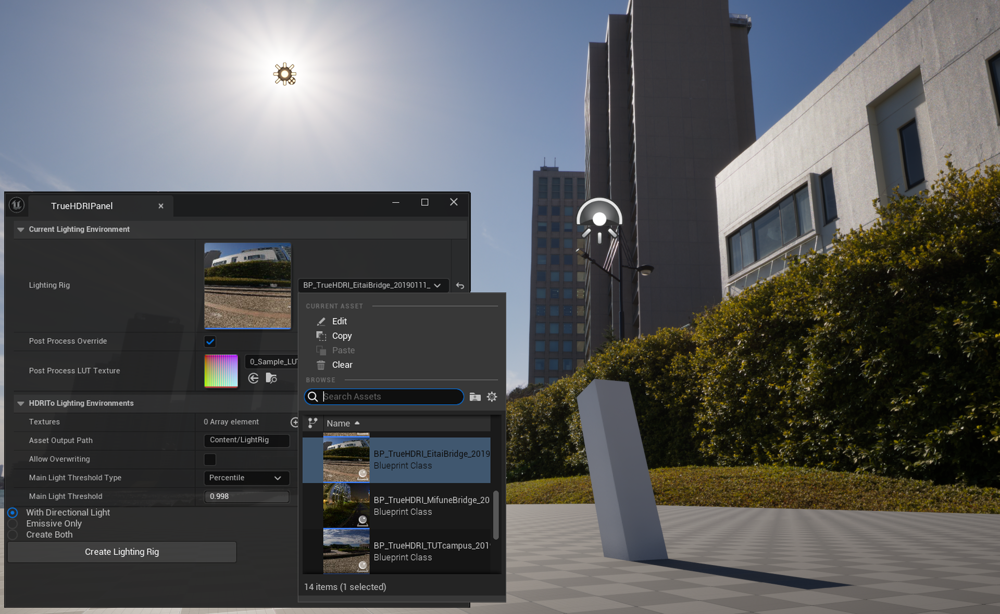
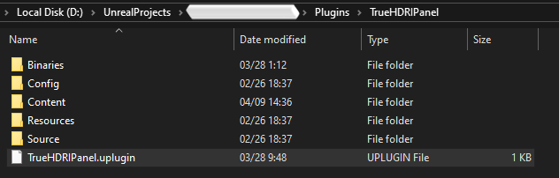
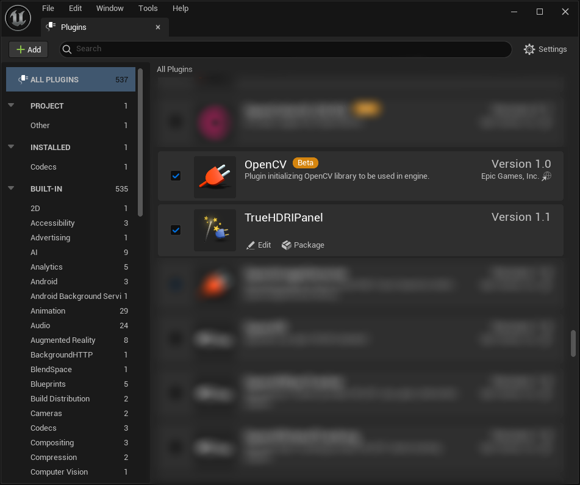
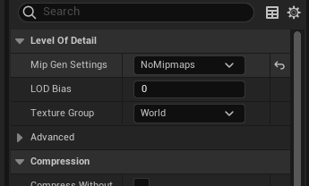
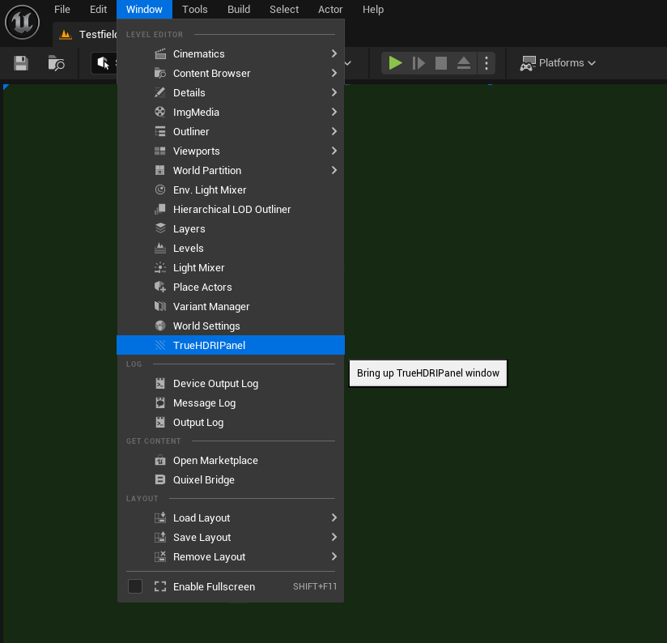
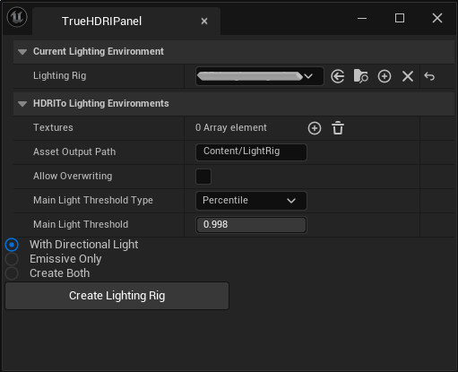
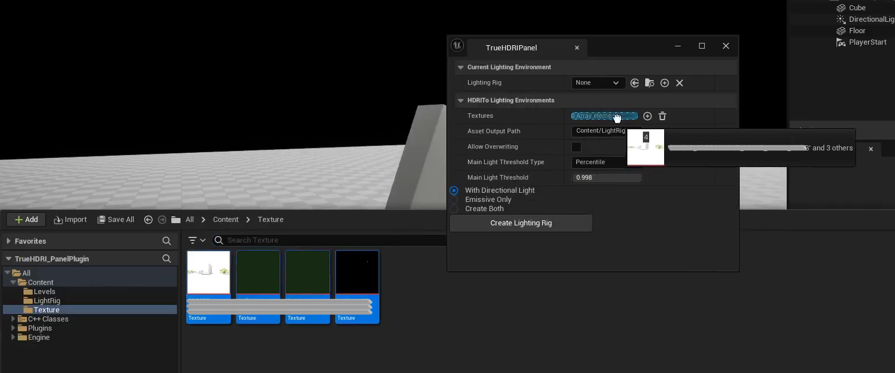

# TrueHDRI-panel
[English docs](./README_en.md)

[デモ映像](https://youtu.be/zwyQYrWBvSc)

TrueHDRI-panel は、HDRI を光源環境としてセットアップする Unreal Engine のプラグインです。

## 特徴
- Unreal Engine のライティング環境に HDRI をそのまま投げ込んだだけでは、ダイナミックレンジの高輝度な部分が活かされておらず、正しいレンダリングが行われません。本プラグインでは、画像の高輝度部分を Sun light として解釈した HDRI 環境を自動で生成しています。これにより、パストレーシングを用いない Lumen 環境においても HDRI の光源から落ち影などの計算を行うことが可能となります。
- 制作した光源環境はパネル UI から選択することで、レベル上から簡単に利用することが可能です。
- ゲームのランタイム環境、映像コンテンツ制作用途のそれぞれに対応した適切な光源環境を構築することが可能です。
  - パストレーシング環境での Look-Dev に最適な、すべての輝度を Emissive として扱う光源環境の構築
  - Lumen環境や Lightmap を事前計算するゲームのランタイム環境に合わせた Look-Dev を行うために最適な、輝度の一部を平行光源化した光源環境の構築

本プラグインは、[株式会社バンダイナムコスタジオ](https://www.bandainamcostudios.com/)と[東京工科大学](https://www.teu.ac.jp/)との共同研究プロジェクトの一環として制作されました。  
TrueHDRIとは: https://www.bandainamcostudios.com/projects/truehdri

## プラグインの使い方

### セットアップ
1. プラグインを利用したいプロジェクトの .uproject と同じフォルダ内に Plugins という名前のフォルダがない場合は、これを作成してください。
2. Plugins フォルダ内に、プラグインZipファイルの中身をコピーしてください。ペースト後の階層状態は以下のようになります。  
[プロジェクトフォルダ]/Plugins/TrueHDRIPanel/TrueHDRIPanel.uplugin

- プロジェクトを起動し、Edit > Plugins から TrueHDRIPanel プラグインおよび OpenCV プラグインが有効化されていることを確認してください。自動での有効化が行われていない場合は、チェックボックスから有効化を行ってください。  

### HDRI から 光源環境Blueprint を生成する
- テクスチャアセットの用意
EXR形式のテクスチャ画像を Unreal Engine のプロジェクトに読み込みます。  
＊EXR画像が**sRGBカラースペース**に変換されたものであることを確認してください。  
読み込んだテクスチャアセットの Level Of Detail > Mip Gen Settings を **NoMipmaps** に設定してください。これにより、テクスチャ画像がフィルタリングの掛からない高い解像度で利用されるようになります。  

- プラグインパネルの呼び出し  
トップバーの Windows > TrueHDRIPanel からプラグインのパネルを呼び出してください。  

  
ここでは二段目の HDRI To Lighting Environments を利用します。

- 光源環境アセットの生成  
コンテンツドロワーのテクスチャアセットを HDRI To Lighting Environments > Textures にドラッグ&ドロップして、光源環境化する HDRI を指定してください。  

### レベル上で使用する光源環境Blueprintの選択
- プラグインパネルの一段目 Current Lighting Environment > Lighting Rig より事前に生成した光源環境アセットを選択すると、そのアセットが現在のレベル上に反映されます。  
また、パネル UI を通した光源環境の変更時には (レベル上に存在しない場合 Sky Light アクター が生成され)、 Sky Light Recapture が自動で行われます。

## 生成用設定値の説明
- Asset Output Path：
  - 生成される光源環境のBlueprint を保存するディレクトリを、Game ディレクトリから指定します
- Allow Overwriting：
  - 同じテクスチャアセットから過去に生成した光源環境がある場合の上書きを許可します
- Main Light Threshold Type：
  - 画像内の輝度の一部を平行光源化するときに、平行光源化を行う輝度の範囲を決める方法について選択します
    - Percentile パーセンタイル値のうち、しきい値を超えるもの
    - Percent 画像内の最低輝度と最大輝度の間のパーセントで、しきい値を超えるもの
    - Percent Ave Max 画像内の平均輝度と最大輝度の間のパーセントで、しきい値を超えるもの
    - Direct Value 指定された値を輝度としてあつかい、それを超える輝度のもの
- Main Light Threshold：
  - 上記設定で指定された種類の輝度値を設定します
- 生成するアセットの種類：
  - With Directional Light しきい値を超える輝度をテクスチャ画像から抜き取り平行光源化します
    - `-Directional` のサフィックスがつきます
  - Emissive Only テクスチャ画像が持つ輝度をそのまま Emissive として利用します
    - `-PathTrace` のサフィックスがつきます
  - Create Both 上記二種類のアセットを両方生成します  
  設定ののちに Create Lighting Rig ボタンを押すことで、以下のアセットが生成されます:
    - 光源環境Blueprint BP_[テクスチャ名] (Asset Output Pathに)
    - 全球画像のマテリアル M_[テクスチャ名] (Asset Output Pathに)
    - (平行光源化した場合) 平行光源化された部分が差し引かれたテクスチャアセット [テクスチャ名]-NoSun (元テクスチャーアセットの隣に)

## 更新履歴
- 2024/06/06
  - GitHUB readme に利用ドキュメントを追加
